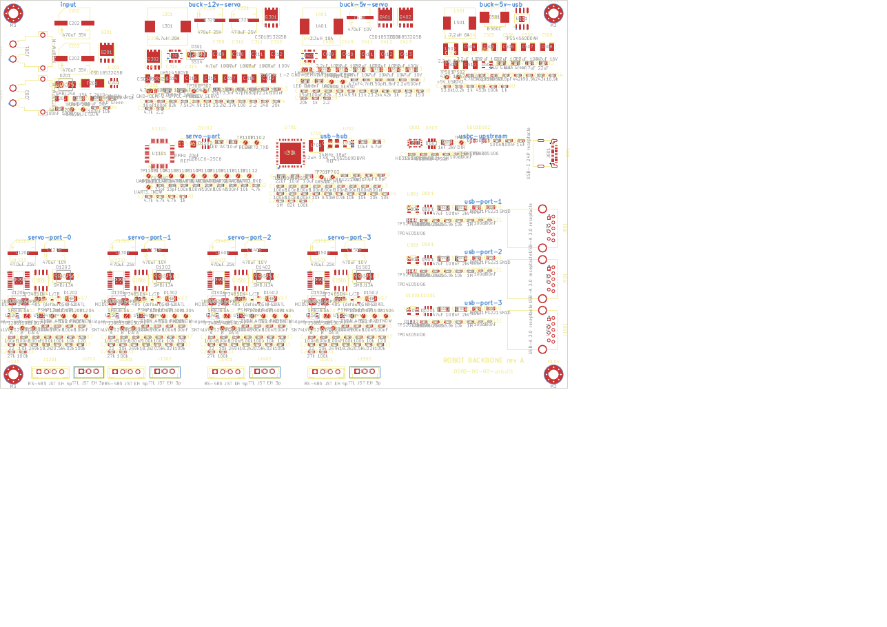

# Placement diagram — robot backbone PCB

The board floorplan that `backbone/backbone.kicad_pcb` implements. Every
footprint from the schematic is on the board with its net and schematic link,
packed block by block into one placement rule area per hierarchical sheet. The
board is **not routed**; this is the starting point for layout, following the
rules in HARDWARE.md §6.

`placement.svg` is the same view as vector graphics (F.Cu, F.SilkS, Edge.Cuts,
Cmts.User region labels). Regenerate both with
`tools/schematic-gen/pcb.py` and `kicad-cli pcb export svg …` (see
`tools/schematic-gen/README.md`).

## Floorplan

Board 190 × 130 mm, 4 layers (F.Cu / In1.Cu = GND / In2.Cu = PWR / B.Cu),
origin top-left, M3 mounting holes 4.5 mm in from each corner. Coordinates in mm.

| Region (rule area name) | Sheet | x | y | Edge connectors |
|---|---|---|---|---|
| `input` | 2 input | 0–46 | 0–78 | J201 19 V IN, J202 19 V OUT on the **left** edge |
| `buck-12v-servo` | 3 | 46–98 | 0–44 | — |
| `buck-5v-servo` | 4 | 98–146 | 0–44 | — |
| `buck-5v-usb` | 5 | 146–190 | 0–44 | — |
| `servo-uart` | 11 | 46–90 | 44–78 | — |
| `usb-hub` | 7 | 90–134 | 44–78 | — |
| `usbc-upstream` | 6 | 134–190 | 44–66 | J601 USB-C on the **right** edge |
| `usb-port-1/2/3` | 8–10 | 134–190 | 66–83 / 83–100 / 100–117 | J801, J901, J1001 USB-A 3.0 on the **right** edge |
| `servo-port-0..3` | 12–15 | 0–33.5 / 33.5–67 / 67–100.5 / 100.5–134 | 78–130 | J1x01 RS-485 + J1x02 TTL on the **bottom** edge |
| `usb_section` (keep-out anchor, no placement source) | — | 90–190 | 44–130 | used by `backbone.kicad_dru`: servo-rail copper may not enter it |

Why this shape (HARDWARE.md §6):

- **Power enters on the left and flows right along the top.** Input
  protection and the three bucks sit in one row; their switch nodes and
  inductors are as far from the USB section as the board allows. The 19 V
  input bulk bank is next to the ideal diode, the servo bulk banks next to their
  bucks (star distribution starts there).
- **The hub sits between the USB-C upstream and the three USB-A ports**, so
  every SuperSpeed pair is short and stays on F.Cu over the In1.Cu ground plane.
  The whole USB block is the `usb_section` rule area: PWR_SERVO copper is barred
  from it, so servo return currents never flow under the USB pairs.
- **The four servo ports are a row along the bottom edge**, each with its own
  e-fuses, 470 µF polymer caps and TVS next to its two connectors, with the
  CH344 directly above them (short TXD / RXD / TNOW lines, TTL DATA runs short).
- The 3-pin / 4-pin EH housings alternate along the bottom edge: RS-485 (12 V)
  and TTL (5 V) connectors of the same port are side by side so the keying by
  housing size stays obvious.

## What the generator placed and what is left for layout

Done by `tools/schematic-gen/pcb.py`:

- all 430 footprints with nets, schematic paths, sheet names, LCSC / fields
  (schematic parity: 0 issues), DNP and exclude-from-BOM attributes;
- edge connectors rotated so their pads face inboard and the mating face points
  off the edge, every other part packed largest-first inside its region;
- placement rule areas (source = sheet name) and the `usb_section` area;
- board outline, four M3 holes, `${KKH_VERSION_DATE}` and the revision text on
  F.SilkS, `JLCJLCJLCJLC` order-number placeholder on B.SilkS.

Still to do in the PCB editor (DRC on the placed board: 499 unconnected pads,
37 clearance errors at IC pads from the net-class clearances, 4 annular-ring
errors inside the USB-C footprint, silkscreen overlaps from the dense packing):

1. Tidy placement within each region: the packer is a grid, not a layout.
   Decoupling caps belong at their pins, the buck input loops want to be tiny,
   the hub crystal next to XI/XO, the ESD arrays at the connectors.
2. Route: USB3_SS / USB2_HS geometry from the JLCPCB impedance calculator
   (JLC04161H-7628) into the net classes, polygons for the 19 V and servo
   rails, star pours per port from each buck's bulk bank, thermal vias under
   the QFN / HTSSOP / SON pads.
3. Scope the SW_NODE / PWR_SERVO class clearances and the 3 mm
   `sw_node_away_from_signals` rule to tracks and zones (`A.Type` conditions in
   `backbone.kicad_dru`) so they stop firing at the ICs' own pins.
4. V4: check every imported footprint against its datasheet drawing,
   especially the USB-C QT shell legs (two overlapping oval PTH pads per side)
   and the right-angle connectors' orientation on the edges.
5. Enter the JLC04161H-7628 physical stackup in Board Setup.
